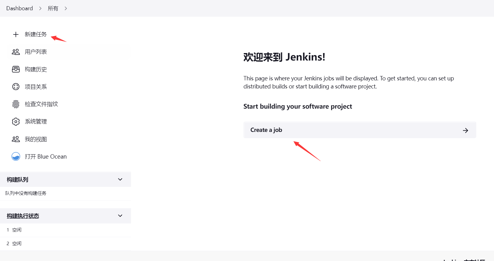
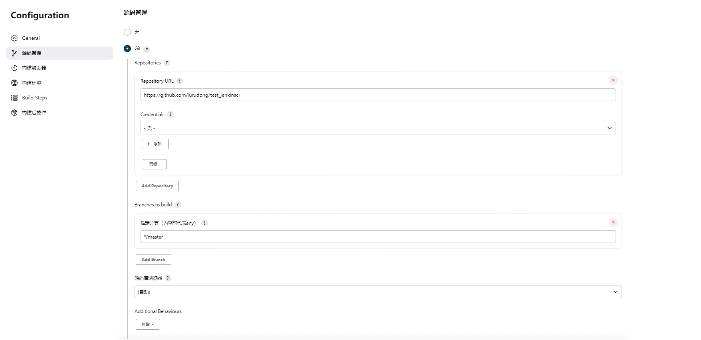
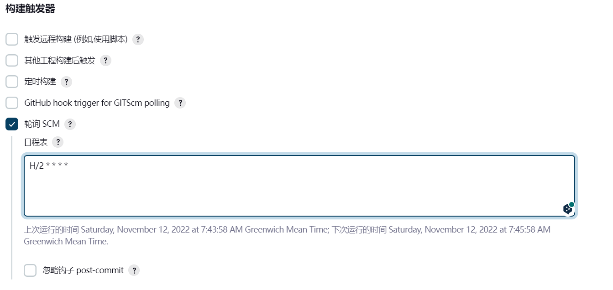
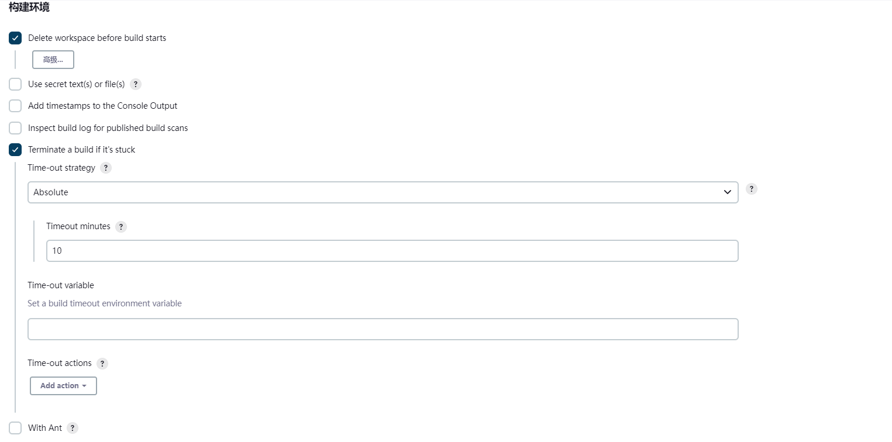
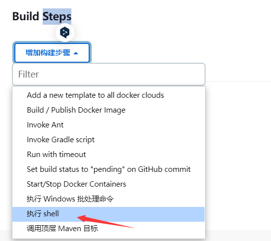
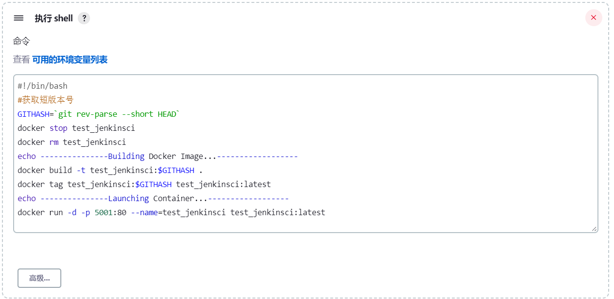
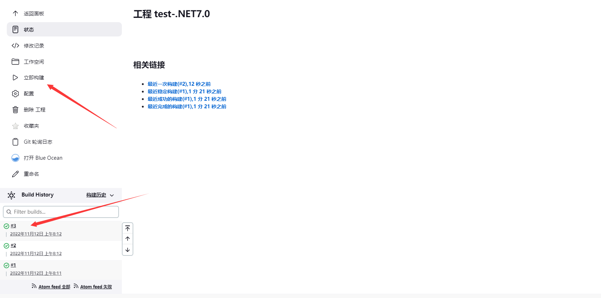
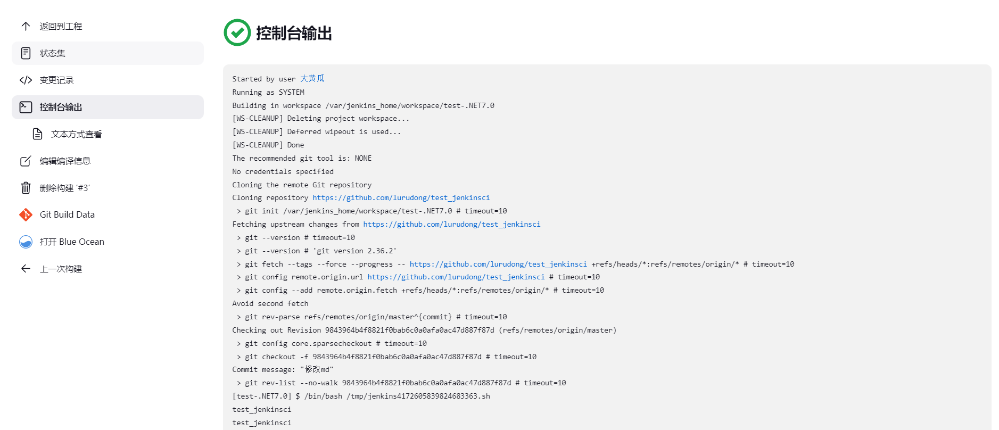

# Jenkins安装

安装其实很简单，就不多说了，请看[这篇文章](https://www.jenkins.io/zh/doc/book/installing/)，自行选择安装方式 

以上是简单dokcer 安装方式：

```shell
docker run  -u root -d -p 8081:8080 -p 50000:50000   -v jenkins-data:/var/jenkins_home  -v /var/run/docker.sock:/var/run/docker.sock   jenkinsci/blueocean
```

# 配置jenkins

### 1、创建一个jenkins项目

**新建项目**



**构建一个自由风格的软件项目**


### 2、源代码管理

**这里可以指定git分支**



### 3.构建触发器

**这里设置轮询去git拉取代码，代码有更新情况就发触发构建操作，H/2 * * * * 每2分钟轮询拉取代码一次**

**还可以用别的方式来使用，自行研究**



### 4.构建环境

**Terminate a build if it's stuck  如果构建卡住，终止构建;这里是 Time-out strategy 超时策略 Absolute 绝对时间，Timeout minutes 超时时间10分钟构建失败； 还有其他设置操作，自行设置**

**注意记得 Delete workspace before build starts 选择，每次在开始构建之前删除工作区，不选择的话，会浪费资源**



### 5.构建脚本Execute Shell




**添加shell如下：**

**脚本我使用了docker 普通方式,下面有多少脚本方式，自行选择**



**点击保存回到test-.NET7.0项目界面，点击“立即构建”**

**显示绿色代表成功**



还可以点击相关构建任务，进去查看构建任务相关情况




# docker 普通方式

```shell
#!/bin/bash
#获取短版本号
GITHASH=`git rev-parse --short HEAD`
docker stop test_jenkinsci
docker rm test_jenkinsci
echo ---------------Building Docker Image...------------------
docker build -t test_jenkinsci:$GITHASH .
docker tag test_jenkinsci:$GITHASH test_jenkinsci:latest
echo ---------------Launching Container...------------------
docker run -d -p 5001:80 --name=test_jenkinsci test_jenkinsci:latest
```

# 安装docker-conpose

因为jenkins需要用到本地的docker-compose环境，所以，安装完以上步骤的jenkins后，使用

```bash
docker exec -it jenkins /bin/bash
```

进入**容器内部**安装docker-compose，[安装步骤去](https://github.com/yeasy/docker_practice/blob/master/compose/install.md)

# 示例启动脚本：run.bat

```shell
该脚本用于Windows Server中拉取最新代码并启动.Net服务，可以将脚本添加到Windows计划任务中进行定时更新服务。

cd  ./test_jenkinsci
git pull
cd  ./test_jenkinsci
start dotnet run
```

# Jenkins构建执行shell

```shell
 #!/bin/sh
 cd /var/lib/jenkins/workspace/src/test_jenkinsci
 docker container prune << EOF
 y
EOF
docker container ls -a | grep "test_jenkinsci"
if [ $? -eq 0 ];then
    docker container stop test_jenkinsci
    docker container rm test_jenkinsci
fi
docker image prune << EOF
y
EOF
docker build -t test_jenkinsci .

docker run -d -p 5000:80 --name=test_jenkinsci test_jenkinsci
```

# Jenkins系统用户授权

```
sudo usermod -a -G docker jenkins
```

# 重启Jenkins

```
systemctl restart jenkins
```
